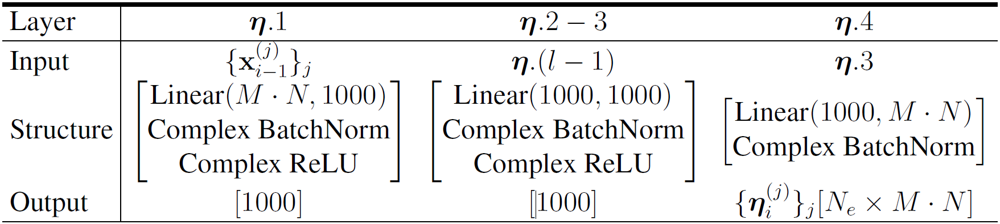

# FLI for Radar Beampattern Design under Constant Modulus Constraint


## Description

FLI (Fast, Learned and Interpretable) is a deep learning algorithm that employs the concept of algorithm unrolling to solve the beampattern design problem and the constant modulus constraint.


## Architecture Details

Although the code is pretty flexible and can be configured the way you may like, we use the following setup in our expirements.


1. The network structure is visualized as follows.


where the projection and retraction operations are defined as follows.


and the exansion operation concatenates to the its inputs as follows.


2. The implementation details of each unrolled step (block in FLI) is defined as follows.


3. The initialization block is defined as follows.


4. The direction evaluation module is defined as follows.




5. The architecture details of the expansion layer is as follows.


## Code 

### Train

A train example is in [train.sh](FLI/train.sh). You can either use it or play with the configurations to your linking such as follows.
```sh
cd FLI
python train.py \
  --model-config "model1" \
  --train-config "train1" \
  --dataset-config "dataset_random" \
  --loss-config "loss1" \
  --model "Model1" \
  --datamodule "BeamPatternDataModule" \
  --callbacks "LogValBeampatternResult" \
              "LogValNumericalResult" \
              "LogScenarioResult"
```

all configs are set in [configs](FLI/configs) where we have separate folders for [models](FLI/configs/models/), [train](FLI/configs/train/), [losses](FLI/configs/losses/) and [datasets](FLI/configs/datasets/)

### Test


An example for testing the code is found in [test.py](FLI/test.py). You can use it as follows.
```sh
python test.py \
  --model-config "model1" \
  --train-config "train1" \
  --dataset-config "dataset_random" \
  --loss-config "loss_grad_guide" \
  --model "Model1" \
  --datamodule "BeamPatternDataModule" \
  --callbacks "LogValBeampatternResult" "LogValNumericalResult" "LogScenarioResult" \
  --file "path_to_the_checkpoint_file.ckpt"
```


### Structure

1. [utils](FLI/utils): contains some utilities that are used throughout the code.
Most importantly, it contains [base_classes.py](FLI/utils/base_classes.py) where it has all the configuration classes.

2. [configs](FLI/configs): contains all examples of configurations used for datasets + training models + testing.

3. [dataset.py](FLI/datasets/base_dataset.py): contains the dataset module to load data that was saved from Matlab and prepares it for PyTorch model.


